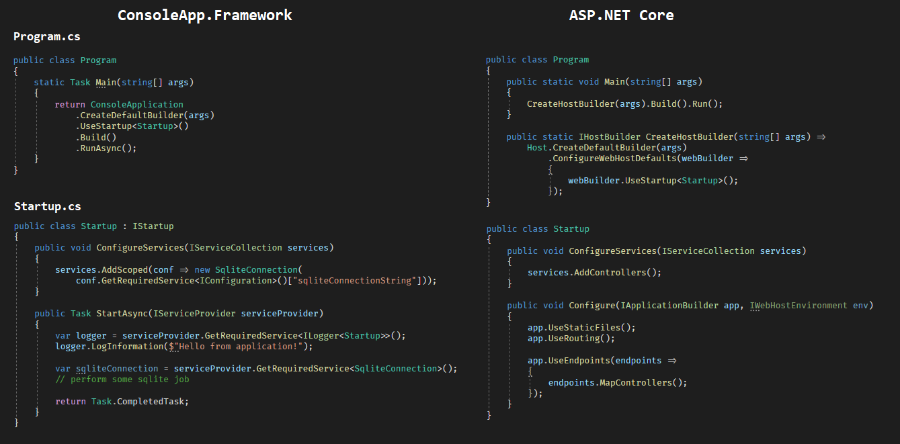

# ConsoleApp.Framework

Simple console application framework that follow up ASP.NET Core style with startup class, built-in dependency injection, appsettings.json, logging etc.

## Overview

_Click on image to see full resolution comparsion._

## Usage

- Add following nuget package https://www.nuget.org/packages/ConsoleApp.Framework/0.1.0

- Create `Startup` file that inherits from `IStartup`

- Call `ConsoleApplication.CreateDefaultBuilder(args).UseStartup<Startup>()` in your `Program.cs` and build your app.

Check also other methods that ConsoleApplicationBuilder expose.

For examples check out the example project <a href="https://github.com/malciin/console-application-framework/tree/main/examples/ConsoleExample">here</a>.

## Todo

- Allow using Autofac or other IoC library simmilar way as the ASP.NET does
- Allow injecting `IConfiguration` to Startup file
- Improve way of dealing with synchronous console apps